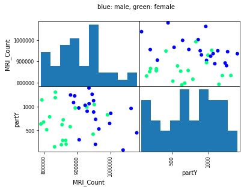
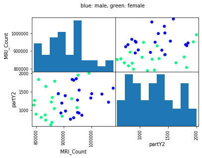

# Chen-E-QLSC612
## QLSC612 Practical Assessment
This repository was submitted for The BrainHack School 2020 and QLSC612 Fundamentals of Neuro Data Science (McGill University and Dr. Jean-Baptiste Poline)

### Requirements
Running `myanalysis.ipynb` requires the following dependencies: 
* `pandas` (including `pandas.plotting`)
* `numpy`
* `random`
* `csv`
* `scipy.stats`
* `matplotlib.pyplot`

### How to Run the Code 
1. To install the required dependencies, use `pip install -r requirements.txt`. 
2. To run `myanalysis.ipynb` and print the expected outputs (statistics and figures), open the jupyter notebook using the command `jupyter notebook` and run all kernels.  

### Expected Outputs
`myanalysis.ipynb` creates two continuous random variables: `partY` and `partY2`. Related t-test correlations (using the command `scipy.stats.ttest_rel(data[{var1}], data[{var2}], nan_policy="omit")`) are run on both random variables with each of the existing variables in the `brainsize.csv` file: `FSIQ`, `VIQ`, `PIQ`, `Weight`, `Height`, and `MRI_Count`. 

The expected statistical test outputs are as follows: 

#### For variables correlated with `partY`: 
variable | `t` | `p`
---------|-----|----
`FSIQ` | -10.91 | 2.05e-13 
`VIQ` | -10.99 | 1.66e-13 
`PIQ` | -10.93 | 1.93e-13 
`Weight` | -10.01 | 4.52e-12
`Height` | -11.62 | 4.46e-14 
`MRI_Count` | 79.44 | 9.47e-45 

#### For variables correlated with `partY2`: 
variable | `t` | `p`
---------|-----|----
`FSIQ` | -18.04 | 1.60e-20 
`VIQ` | -18.12 | 1.37e-20
`PIQ` | -18.06 | 1.51e-20 
`Weight` | -16.82 | 6.44e-19 
`Height` | -18.51 | 1.31e-20
`MRI_Count` | 79.53 | 9.10e-45 

The expected figure outputs should look as follows: 

1. When plotting the statistical relationship between the most significant correlation for `partY`, the figure should look like:   

 
2. When plotting the statistical relationship between the most significant correlation for `partY2`, the figure should look like: 

